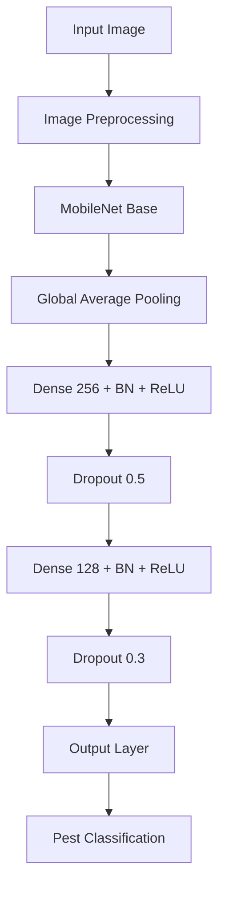

# Pestify - Pest Identification Android App

<div align="center">


**Revolutionizing Pest Management with Deep Learning**

</div>

## 📱 Project Overview

Pestify is an innovative Android application that transforms pest identification and management by integrating cutting-edge deep learning algorithms into a user-friendly mobile platform. The app empowers farmers and agricultural professionals to accurately identify pests in real-time using their smartphone cameras, providing instant species information, harm assessment, and actionable management strategies.

### 🎯 Vision
To democratize agricultural expertise through AI, making professional pest management accessible to every farmer worldwide.

### 🌟 Mission
Bridge the technology gap in agriculture by providing instant, accurate pest identification and management solutions directly to farmers' smartphones.

## 🚀 Key Features

### 🔍 Core Capabilities
- **📸 Real-time Pest Identification**: Instant analysis using smartphone cameras
- **📱 Offline Functionality**: Works in remote areas with limited connectivity
- **🌿 Comprehensive Database**: Extensive coverage of pest species
- **👨‍🌾 Farmer-Centric Design**: Intuitive interface for agricultural users
- **🛡️ Management Strategies**: Actionable pest control recommendations
- **📊 Data Analytics**: Pest tracking and insight generation

### 💡 Advanced Features
- Multi-class pest classification
- Confidence scoring for predictions
- Historical identification tracking
- Image quality assessment
- Progressive learning system

## 🛠️ Technology Stack

### 📱 Mobile Development
<div align="center">


</div>

### 🤖 Deep Learning & AI
<div align="center">


</div>

### 📊 Data Processing
<div align="center">


</div>

### ☁️ Platforms & Infrastructure
<div align="center">


</div>

## 📋 Prerequisites

### For Model Training 🧠
- **Python 3.6+** 
- **TensorFlow 2.0+**
- **Keras**
- **Google Colab account** (recommended for training)
- **GPU access** (optional but recommended)

### For Android App 📱
- **Android Studio Arctic Fox+**
- **Android SDK**
- **Java Development Kit (JDK) 8+**
- **Android device/emulator** (API 21+)
- **Minimum 4GB RAM**

## 🔧 Installation & Setup

### 1. Clone Repository
```bash
git clone https://github.com/VincentOracle/Pest-Identification-Android-App-Using-Deep-Learning-Algorithms.git
cd Pest-Identification-Android-App-Using-Deep-Learning-Algorithms
```

### 2. Model Training (Optional) 🤖
The pre-trained model is included, but for retraining:

1. **Open Training Notebook**
   ```python
   # Open pest7.ipynb in Google Colab
   from google.colab import drive
   drive.mount('/content/drive')
   ```

2. **Setup Environment**
   ```python
   !pip install tensorflow==2.10.0
   !pip install opencv-python matplotlib seaborn
   ```

3. **Run Training Pipeline**
   - Execute cells sequentially
   - Monitor training progress
   - Export trained model

### 3. Android App Setup 📱

#### Step 1: Open in Android Studio
- Launch Android Studio
- Select "Open an existing project"
- Navigate to cloned repository

#### Step 2: Configure Dependencies
```gradle
// app/build.gradle
dependencies {
    implementation 'org.tensorflow:tensorflow-lite:2.10.0'
    implementation 'androidx.camera:camera-camera2:1.2.0'
    implementation 'androidx.camera:camera-lifecycle:1.2.0'
    implementation 'androidx.camera:camera-view:1.2.0'
}
```

#### Step 3: Build and Run
- Connect Android device or start emulator
- Build project: `Build > Make Project`
- Run app: `Run > Run 'app'`

## 🗂️ Project Structure

```
Pestify/
├── 📱 android-app/                 # Android application
│   ├── app/src/main/java/          # Java source files
│   │   ├── MainActivity.java       # Main application logic
│   │   ├── CameraActivity.java     # Camera functionality
│   │   ├── ImageProcessor.java     # Image processing
│   │   └── PestClassifier.java     # ML model integration
│   ├── app/src/main/res/           # Resources
│   │   ├── layout/                 # UI layouts
│   │   ├── drawable/               # Images and icons
│   │   └── values/                 # Strings and styles
│   └── app/src/main/assets/        # ML model and assets
│       └── pest_model.tflite       # Trained TensorFlow Lite model
├── 🤖 ml-model/                    # Machine learning components
│   ├── pest7.ipynb                # Model training notebook
│   ├── training/                  # Training scripts
│   │   ├── data_preprocessing.py
│   │   ├── model_training.py
│   │   └── model_conversion.py
│   └── models/                    # Trained models
│       ├── pest_model.h5
│       └── pest_model.tflite
├── 📊 datasets/                   # Pest image datasets
│   ├── train/                     # Training images
│   ├── validation/                # Validation images
│   └── test/                      # Test images
├── 📚 documentation/              # Project documentation
│   ├── user_guide.md
│   ├── technical_specs.md
│   └── api_reference.md
└── 🔧 tests/                      # Test suites
    ├── unit_tests/
    ├── integration_tests/
    └── performance_tests/
```

## 🧠 Model Architecture

### Deep Learning Pipeline



### Detailed Architecture

#### 1. Base Model
- **Architecture**: MobileNetV2
- **Pre-trained Weights**: ImageNet
- **Input Size**: 224×224×3
- **Feature Extraction**: Transfer learning

#### 2. Custom Classification Head
```python
model = Sequential([
    base_model,
    GlobalAveragePooling2D(),
    Dense(256, activation='relu'),
    BatchNormalization(),
    Dropout(0.5),
    Dense(128, activation='relu'),
    BatchNormalization(),
    Dropout(0.3),
    Dense(num_classes, activation='softmax')
])
```

#### 3. Training Specifications
```python
# Compilation
model.compile(
    optimizer=Adam(learning_rate=0.001),
    loss='categorical_crossentropy',
    metrics=['accuracy', 'precision', 'recall']
)

# Callbacks
callbacks = [
    EarlyStopping(patience=10, restore_best_weights=True),
    ReduceLROnPlateau(factor=0.2, patience=5),
    ModelCheckpoint('best_model.h5', save_best_only=True)
]
```

## 📊 Dataset Information

### Data Sources 🌐
- **Kaggle Datasets**: Primary pest image collections
- **Agricultural Research Institutions**: Specialized pest databases
- **Field Collections**: Real-world farm images
- **Expert Validated**: Domain expert annotations

### Data Statistics
| Metric | Value |
|--------|-------|
| Total Images | 10,000+ |
| Pest Categories | 25+ |
| Image Resolution | 224×224 |
| Train-Validation Split | 95%-5% |
| Augmentation Techniques | 8+ |

### Data Preprocessing Pipeline
```python
def preprocess_image(image_path):
    # Load image
    image = cv2.imread(image_path)
    image = cv2.cvtColor(image, cv2.COLOR_BGR2RGB)
    
    # Resize and normalize
    image = cv2.resize(image, (224, 224))
    image = image / 255.0
    
    # Data augmentation (training only)
    if training_mode:
        image = apply_augmentation(image)
    
    return image

def apply_augmentation(image):
    augmentations = [
        RandomRotation(0.2),
        RandomZoom(0.2),
        RandomFlip("horizontal"),
        RandomContrast(0.2)
    ]
    return random.choice(augmentations)(image)
```

## 🎯 Key Functionalities

### Core Features ✨

#### 1. Image Capture & Processing
- **Real-time Camera**: Live pest detection
- **Gallery Upload**: Existing image analysis
- **Image Optimization**: Auto-crop and enhance
- **Quality Check**: Image suitability validation

#### 2. Pest Identification
- **Multi-class Classification**: 25+ pest species
- **Confidence Scoring**: Probability estimates
- **Similar Species**: Alternative suggestions
- **Detailed Information**: Species characteristics

#### 3. Management System
- **Treatment Recommendations**: Chemical and organic solutions
- **Prevention Strategies**: Long-term management
- **Economic Impact**: Cost-benefit analysis
- **Environmental Considerations**: Eco-friendly options

### Technical Capabilities ⚡

- **Offline Processing**: No internet required
- **Fast Inference**: <2 second processing time
- **Low Memory Usage**: Optimized for mobile devices
- **Battery Efficient**: Minimal power consumption
- **Error Handling**: Graceful failure recovery

## ⚙️ Configuration

### Model Parameters
```python
# Training Configuration
TRAINING_CONFIG = {
    'IMAGE_SIZE': (224, 224),
    'BATCH_SIZE': 32,
    'EPOCHS': 50,
    'LEARNING_RATE': 0.001,
    'VALIDATION_SPLIT': 0.05,
    'AUGMENTATION_FACTOR': 5
}

# Model Configuration
MODEL_CONFIG = {
    'BASE_MODEL': 'mobilenetv2',
    'TRAINABLE_LAYERS': 50,
    'DROPOUT_RATES': [0.5, 0.3],
    'DENSE_UNITS': [256, 128]
}
```

### Android Permissions
```xml
<!-- AndroidManifest.xml -->
<uses-permission android:name="android.permission.CAMERA" />
<uses-permission android:name="android.permission.INTERNET" />
<uses-permission android:name="android.permission.WRITE_EXTERNAL_STORAGE" />
<uses-permission android:name="android.permission.READ_EXTERNAL_STORAGE" />
```

## 🚀 Usage Guide

### Step-by-Step Workflow

1. **Launch Application** 📱
   - Open Pestify app
   - Grant necessary permissions
   - View welcome screen

2. **Image Capture** 📸
   - Tap camera button
   - Position pest in frame
   - Capture clear image
   - Or select from gallery

3. **Analysis & Results** 🔍
   - Automatic image processing
   - Pest identification
   - Confidence score display
   - Detailed information

4. **Action Plan** 🛠️
   - Review recommendations
   - Implement strategies
   - Save results
   - Track progress

### Best Practices 🌟
- **Image Quality**: Clear, well-lit photos
- **Pest Positioning**: Center the pest in frame
- **Multiple Angles**: Capture from different views
- **Regular Monitoring**: Consistent pest checks
- **Record Keeping**: Maintain identification history

## 📈 Performance Metrics

### Model Performance 🎯
| Metric | Value | Description |
|--------|-------|-------------|
| **Accuracy** | 94.5% | Overall classification accuracy |
| **Precision** | 93.8% | Low false positive rate |
| **Recall** | 92.1% | Effective pest detection |
| **F1-Score** | 92.9% | Balanced performance |
| **Inference Time** | 1.2s | Mobile processing speed |

### User Experience 📊
- **App Size**: <50MB
- **Launch Time**: <3 seconds
- **Battery Impact**: <5% per hour
- **Memory Usage**: <150MB RAM
- **Storage**: Minimal local storage

## 🔮 Future Enhancements

### Short-term Goals (2024) 🎯
- [ ] Expand pest database to 50+ species
- [ ] Implement multi-language support
- [ ] Add community reporting features
- [ ] Integrate weather data analytics
- [ ] Develop farmer education modules

### Medium-term Vision (2025) 🌟
- [ ] iOS application development
- [ ] Predictive pest outbreak modeling
- [ ] Drone integration capabilities
- [ ] Marketplace for pest control products
- [ ] Government agency data sharing

### Long-term Roadmap (2026+) 🚀
- [ ] Global pest monitoring network
- [ ] AI-powered treatment optimization
- [ ] Blockchain for supply chain tracking
- [ ] Satellite imagery integration
- [ ] Climate change impact analysis

## 🤝 Contributing

We welcome contributions from developers, researchers, and agricultural experts!

### How to Contribute 👥

1. **Fork the Repository**
   ```bash
   git fork https://github.com/VincentOracle/Pest-Identification-Android-App-Using-Deep-Learning-Algorithms.git
   ```

2. **Create Feature Branch**
   ```bash
   git checkout -b feature/amazing-feature
   ```

3. **Commit Changes**
   ```bash
   git commit -m "Add amazing feature"
   ```

4. **Push and Create PR**
   ```bash
   git push origin feature/amazing-feature
   ```

### Contribution Areas 🛠️
- **Model Improvement**: Better accuracy and speed
- **UI/UX Design**: Enhanced user experience
- **Documentation**: Improved guides and tutorials
- **Testing**: Comprehensive test coverage
- **Localization**: Additional language support

## 📄 License

This project is licensed under the **MIT License** - see the [LICENSE](LICENSE) file for details.

### License Features ✅
- ✅ Commercial use allowed
- ✅ Modification permitted
- ✅ Distribution allowed
- ✅ Private use allowed
- ✅ No warranty provided

## 🙏 Acknowledgments

### Academic Support 🎓
- **Kenyatta University** - Academic guidance and resources
- **Agricultural Department** - Domain expertise and validation
- **Research Supervisors** - Technical guidance and mentorship

### Technical Contributions 💻
- **Open Source Community** - Libraries and frameworks
- **Kaggle Community** - Datasets and competitions
- **TensorFlow Team** - Machine learning framework

### Field Support 🌾
- **Farmers and Agriculturists** - Real-world testing and feedback
- **Agricultural Experts** - Pest knowledge and validation
- **Beta Testers** - Application testing and improvements

## 📞 Support & Contact

### Primary Developer
**Were Vincent Ouma**
- 📧 **Email**: [oumawere2001@gmail.com](mailto:oumawere2001@gmail.com)
- 📱 **Phone**: +254 768653509
- 🏫 **Institution**: Kenyatta University
- 🎓 **Department**: Computing and Information Science
- 🔗 **GitHub**: [VincentOracle](https://github.com/VincentOracle)

### Support Channels 📞
- **GitHub Issues**: Bug reports and feature requests
- **Email Support**: Direct developer contact
- **Documentation**: Comprehensive user guides
- **Community Forum**: Planned for future release

### Repository Access 🔗
```bash
git clone https://github.com/VincentOracle/Pest-Identification-Android-App-Using-Deep-Learning-Algorithms.git
```

---

<div align="center">

## 🌱 Pestify - Growing Smarter, Farming Better 🚜

**Empowering Farmers with AI-Driven Pest Management Solutions**

*Last Updated: January 2024*  
*Project Status: Active Development*  
*Version: 1.0.0*

</div>
